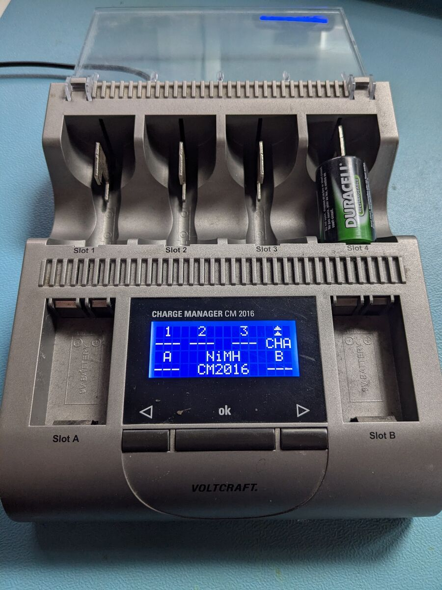
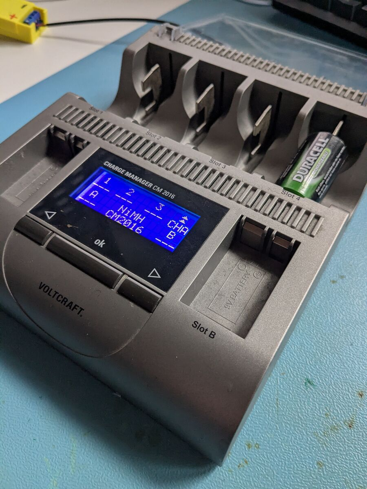
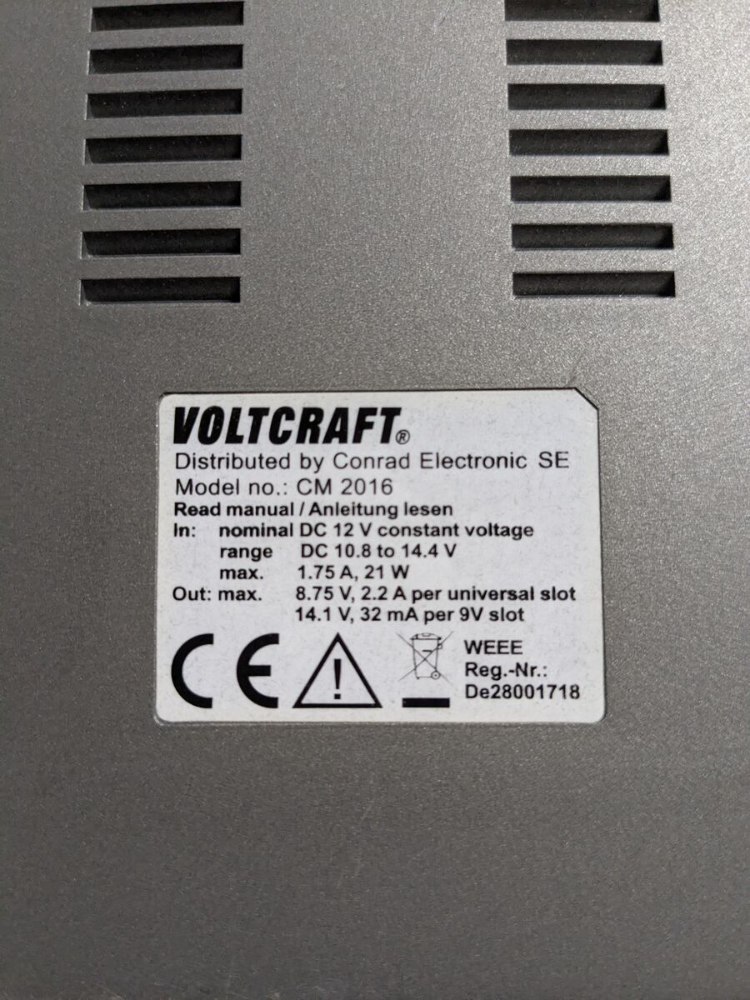
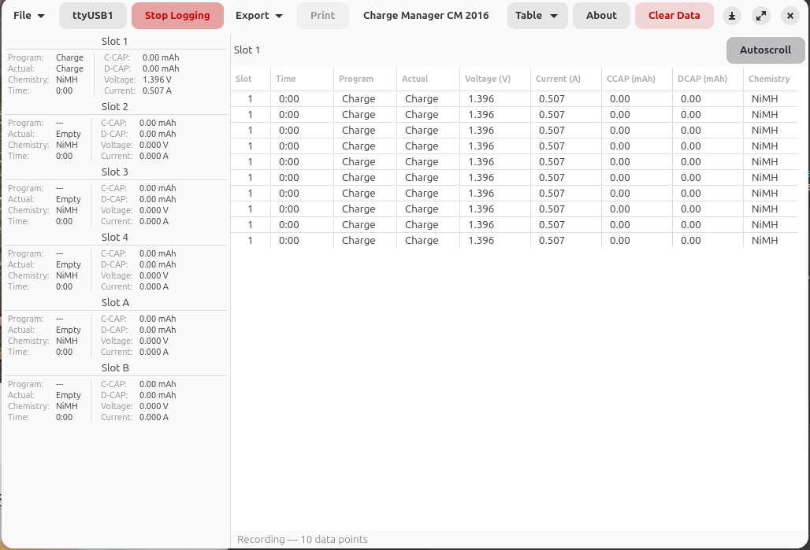
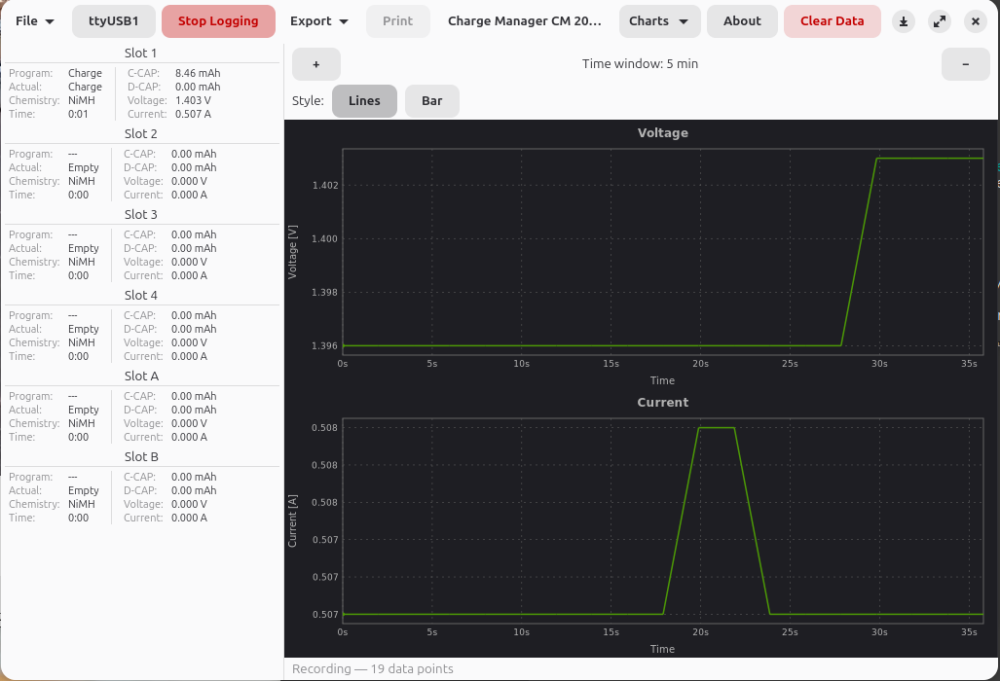
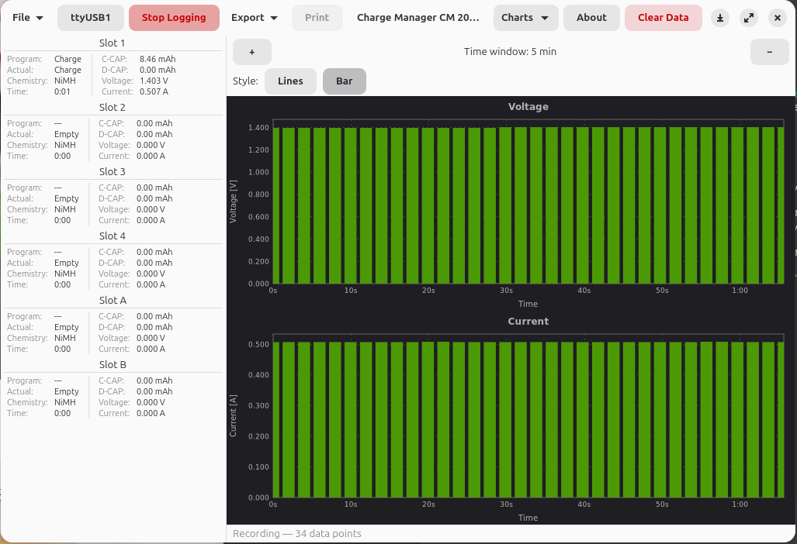
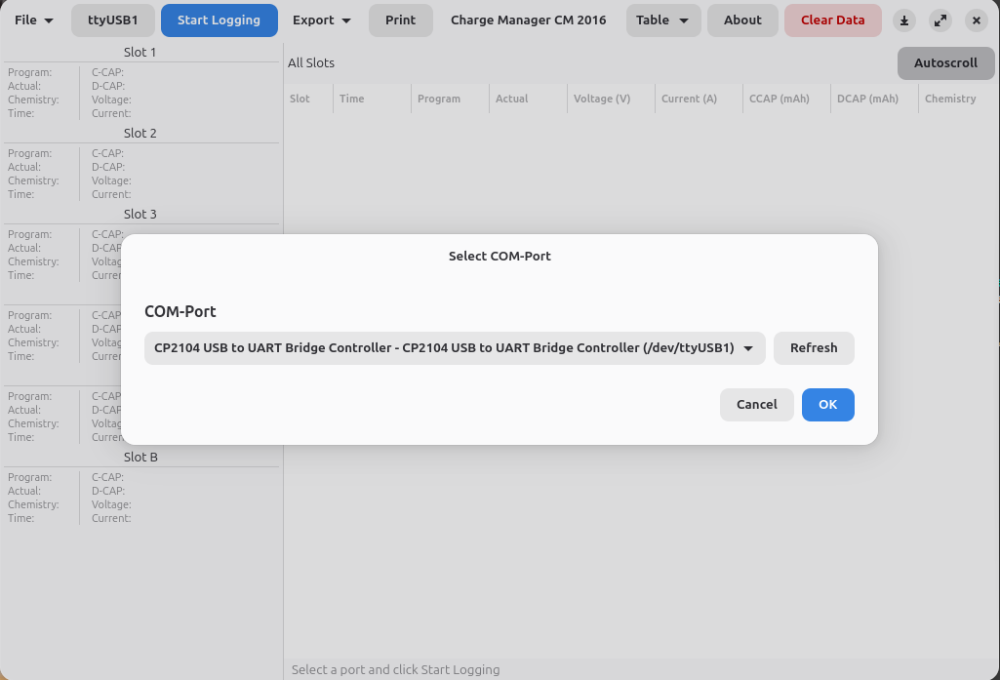

# Charge Manager CM 2016

Open-source Linux GUI for the **Voltcraft Charge Manager CM 2016** battery charger.
Replaces the Windows-only CM2016 Logger V2.10 software with a native
GTK 4 / libadwaita desktop application.

## Features

- **Real-time monitoring** of all 6 charging slots (4x AA/AAA + 2x 9V block)
- **Auto-detect** CM2016 device via USB (Silicon Labs CP210x)
- **Data table** with autoscroll, slot filtering, and clipboard support
- **Voltage and current charts** with line/bar styles and time window control
- **Chart interaction** -- drag zoom, scroll wheel, keyboard navigation, data point tooltips
- **Export** to CSV and spreadsheet (.xlsx) with embedded charts
- **Print** measurement reports (DIN A4/A3 landscape)
- **Save/load** recording sessions with crash recovery
- **Sleep inhibit** prevents system suspend during recording
- **7 languages**: English, German, French, Dutch, Italian, Spanish, Polish

## The Device

<p align="center">
  
  
</p>

<p align="center">
  
</p>

## Screenshots

**Data table with live recording:**



**Voltage and current charts (line style):**



**Bar chart style:**



**Port selection with auto-detect:**



## Requirements

- Linux with GTK 4.14+ and libadwaita 1.5+
- Python 3.10+
- System packages:
  - Debian/Ubuntu/Mint: `sudo apt install python3-gi python3-gi-cairo gir1.2-gtk-4.0 gir1.2-adw-1`
  - Fedora: `sudo dnf install python3-gobject gtk4 libadwaita`
  - Arch: `sudo pacman -S python-gobject gtk4 libadwaita`

## Installation

### Pre-built packages

Download from [GitHub Releases](https://github.com/Kernel-Error/voltcraft-cm2016/releases):

- **Debian/Ubuntu/Mint:** `voltcraft-cm2016_0.1.2_all.deb`
- **Fedora/openSUSE/RHEL:** `voltcraft-cm2016-0.1.2-1.noarch.rpm`

```bash
# Debian/Ubuntu/Mint
sudo dpkg -i voltcraft-cm2016_0.1.2_all.deb

# Fedora/RHEL
sudo dnf install voltcraft-cm2016-0.1.2-1.noarch.rpm

# openSUSE
sudo zypper install voltcraft-cm2016-0.1.2-1.noarch.rpm
```

### From source

```bash
git clone https://github.com/Kernel-Error/voltcraft-cm2016.git
cd voltcraft-cm2016
python3 -m venv --system-site-packages .venv
source .venv/bin/activate
pip install -e .
```

## Usage

Connect the CM2016 via USB cable, then:

```bash
cm2016
```

The application auto-detects the device. Click **Start Logging** to begin recording.

See [docs/manual.md](docs/manual.md) for the full user manual.

## Development

```bash
source .venv/bin/activate
ruff check src/ tests/          # Lint
ruff format src/ tests/         # Format
mypy src/                       # Type check
pytest                          # Run tests (202 tests)
pytest --cov=cm2016             # Tests with coverage
```

## License

[MIT](LICENSE) -- Sebastian van de Meer aka Kernel-Error
